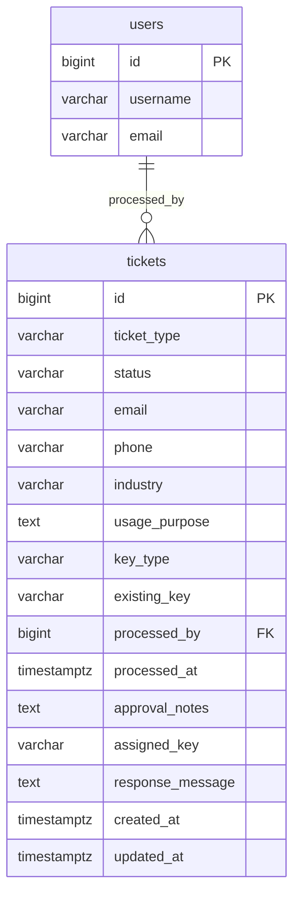

# 密钥申请工单系统数据库设计

## 1. 数据字典（tickets）

| 字段 | 类型 | 允许空 | 默认值 | 说明 |
| --- | --- | --- | --- | --- |
| id | BIGINT | 否 | 自增 | 工单主键 |
| ticket_type | VARCHAR(50) | 否 | - | 工单类型：`key_request` / `key_extension` |
| status | VARCHAR(20) | 否 | `pending` | 工单状态：`pending` / `approved` / `rejected` / `completed` |
| email | VARCHAR(255) | 否 | - | 申请者邮箱 |
| phone | VARCHAR(20) | 否 | - | 申请者电话（支持中国大陆手机号与国际号码） |
| industry | VARCHAR(100) | 否 | - | 所处行业 |
| usage_purpose | TEXT | 否 | - | 用途说明 |
| key_type | VARCHAR(50) | 否 | - | 密钥类型：`personal_trial` / `personal_standard` / `enterprise_trial` / `enterprise_standard` |
| existing_key | VARCHAR(100) | 是 | NULL | 延期工单填写现有密钥 |
| processed_by | BIGINT | 是 | NULL | 处理人 ID，关联 `users.id` |
| processed_at | TIMESTAMP WITH TIME ZONE | 是 | NULL | 处理时间 |
| approval_notes | TEXT | 是 | NULL | 审批备注 |
| assigned_key | VARCHAR(100) | 是 | NULL | 审批通过并完成后分配的密钥 |
| response_message | TEXT | 是 | NULL | 发送给用户的回复内容 |
| created_at | TIMESTAMP WITH TIME ZONE | 否 | `NOW()` | 创建时间 |
| updated_at | TIMESTAMP WITH TIME ZONE | 否 | `NOW()` | 更新时间 |

### 枚举约束

- `ticket_type`: `key_request`, `key_extension`
- `status`: `pending`, `approved`, `rejected`, `completed`
- `key_type`: `personal_trial`, `personal_standard`, `enterprise_trial`, `enterprise_standard`

### 条件约束

- `ticket_type='key_extension'` 时：`existing_key` 必填且非空白。
- `ticket_type='key_request'` 时：`existing_key` 必须为空。
- `status='pending'` 时：`processed_by` 与 `processed_at` 必须为空。
- `status IN ('approved','rejected','completed')` 时：`processed_by` 与 `processed_at` 必须非空。
- `status='completed'` 时：`assigned_key` 必须非空。

### 索引设计

- `ix_tickets_email(email)`
- `ix_tickets_status(status)`
- `ix_tickets_created_at(created_at)`
- `ix_tickets_ticket_type(ticket_type)`
- `ix_tickets_processed_by(processed_by)`

## 2. ER 图

## 3. 迁移说明

### 升级

1. 进入后端目录：`cd services/backend`
2. 执行迁移：`alembic -c alembic.ini upgrade head`
3. 验证表结构与索引：
   - 表：`tickets`
   - 索引：`ix_tickets_email`、`ix_tickets_status`、`ix_tickets_created_at`、`ix_tickets_ticket_type`、`ix_tickets_processed_by`

### 回滚

1. 回滚一版：`alembic -c alembic.ini downgrade -1`
2. 验证 `tickets` 表和对应索引已移除。

### 注意事项

- `processed_by` 外键使用 `ON DELETE SET NULL`，删除用户不会删除工单。
- 状态流转与“单次处理”业务规则在模型层做校验：
  - 只允许 `pending -> approved/rejected`，`approved -> completed`。
  - 拒绝后不可再审批。
  - 完成后不可再修改。
  - `processed_by/processed_at` 一旦写入不可改写。
- 邮箱、电话、必填与条件必填由模型验证器保障。

## 4. 验证与验收结果

- 已新增迁移：`services/backend/alembic/versions/001_create_tickets_table.py`
- 已新增模型：`app.auth_db.models.Ticket`
- 已补充单元测试（结构、校验、状态转换、单次处理约束）
- 性能与索引有效性通过结构化索引设计保障，后续可按业务量在 `EXPLAIN` 下调优复合索引。
